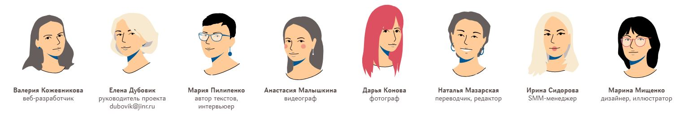

# "Очаровательная наука"

Медиа-проект подготовлен к Международному дню женщин и девушек в науке (11 февраля).

**Размещение:**

- [Github page](https://vkozh.github.io/scigirls.github.io/)
- [Страница проекта: dlnp.jinr.ru/charmingscience](https://dlnp.jinr.ru/charmingscience)

**Технологии:**

- Angular, Angular Material
- Вёрстка по БЭМ
- Bootstrap и SCSS
- По макету дизайнера Figma [(ссылка)](https://www.figma.com/file/zFw16jNYDH8ikSNkUKeBUe/women_scientists?node-id=0%3A1)

**Функционал:**

- Одностраничный сайт
- Меню для навигации на сайте
- При клике на имя героини открывется персональная страница
- При клике на время ▶01:48 открывется видео
- При клике на фотографию открывается полная фотография
- В блоке "О проекте" есть две анимации Lottie
- Всплывающие подсказки и разворачивающийся текст

**Проект подготовлен Группой научных коммуникаций ЛЯП ОИЯИ**

## ScienceGirls

This project was generated with [Angular CLI](https://github.com/angular/angular-cli) version 13.1.2.

## Development server

Run `ng serve` for a dev server. Navigate to `http://localhost:4200/`. The app will automatically reload if you change any of the source files.

## Code scaffolding

Run `ng generate component component-name` to generate a new component. You can also use `ng generate directive|pipe|service|class|guard|interface|enum|module`.

## Build

Run `ng build` to build the project. The build artifacts will be stored in the `dist/` directory.

## Running unit tests

Run `ng test` to execute the unit tests via [Karma](https://karma-runner.github.io).

## Running end-to-end tests

Run `ng e2e` to execute the end-to-end tests via a platform of your choice. To use this command, you need to first add a package that implements end-to-end testing capabilities.

## Further help

To get more help on the Angular CLI use `ng help` or go check out the [Angular CLI Overview and Command Reference](https://angular.io/cli) page.
